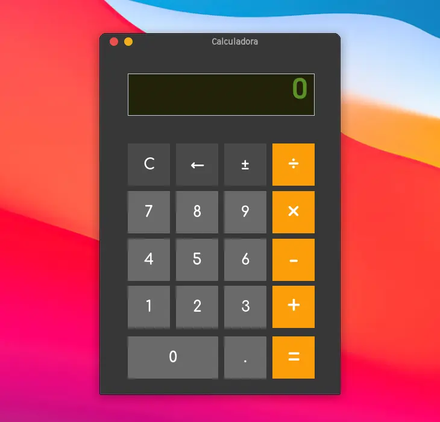
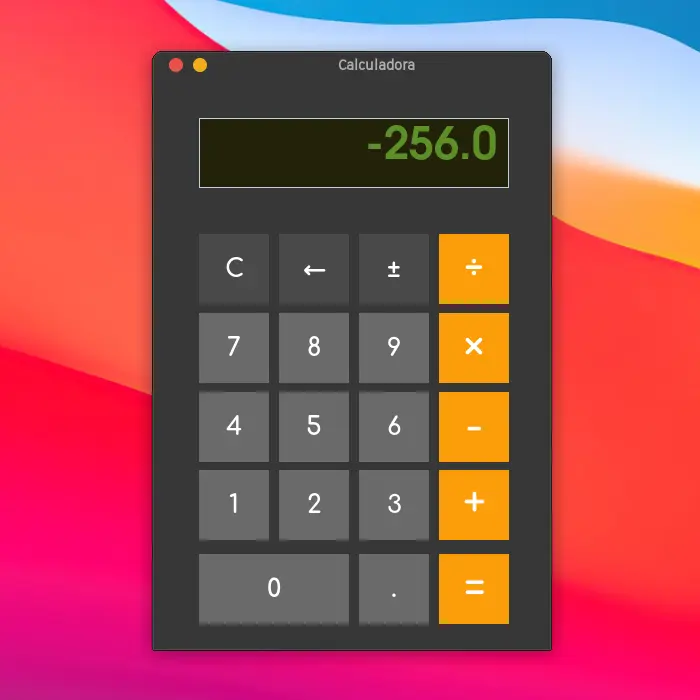

<h1 align="center">Calculadora</h1>
<h3 align="center">✖️➕➖➗</h3>

 

  Calculadora de operaciones básicas de la aritmética, 
    presenta una interfaz gráfica oscura.

 

  

☕

<h2 align="center">Funcionalidades</h2>

<h3>Operaciones</h3>
<ul>
    <li><h4>➕ Suma</h4></li>
    <li><h4>➖ Resta</h4></li>
    <li><h4>✖️️️️ Multiplicación</h4></li>
    <li><h4>➗ División</h4></li>
</ul>

<h3>Otras</h3>
<ul>
    <li><h4>🧹 Limpiar</h4></li>
    <li><h4>⬅️ Remover</h4></li>
    <li><h4>➕ / ➖ Cambiar signo</h4></li>
</ul>

 

☕

<h2 align="center">Tecnologías</h2>
<ul>
    <li>☕ Java 20</li>
    <li>🪟 Swing UI</li>
</ul>

 

☕

<h2 align="center">Desarrollador</h2>
Hiram Shamed Ambriz Rubio
 

 

☕

